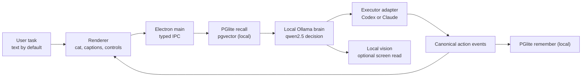

# Roro

**A private desktop coding companion that works in your repo and remembers how you work.**

Roro turns a typed task into a real coding-agent run against the project you
choose: it recalls your local preferences, asks a local Ollama brain to plan the
turn, streams Codex or Claude through one action timeline, and keeps useful
lessons for next time. The pixel cat makes the loop visible, but the job is
coding help with continuity.

The v0 promise is intentionally narrow: local-first coding help that gets better
because it remembers how *you* work.

```text
ask -> recall memory (local) -> think on local Ollama -> run Codex or Claude -> remember the result (local)
```

Privacy promise: Roro's default brain, recall, embeddings, and memory run on
your machine with local Ollama and local storage. Memory contents are encrypted
at rest by default with the OS keychain, and Roro fails loud instead of silently
saving plaintext if that keychain is unavailable. Roro itself does not require
accounts, app-owned telemetry, or a cloud-model key; optional cloud brain and
executor paths only run when you explicitly configure them.

See [`PUBLIC.md`](PUBLIC.md) for the path to public readiness and
[`HANDOFF.md`](HANDOFF.md) for current engineering truth.

## Why This Exists

Most coding agents still feel like command-line tools with better autocomplete.
Roro makes the agent loop visible and social:

- the cat changes posture when the system is listening, thinking, working, done,
  or stuck
- the brain's decide phase appears as the "thinking" layer
- executor output becomes a normalized action timeline
- local memory recall is surfaced as a visible memory beat
- optional screen reads show a visible "Taking one screen snapshot." beat before capture
- the same character layer can run inside the full app or as a transparent
  floating desktop agent

The intended demo is simple: ask the character to fix a bug, watch it plan, watch
it run the coding agent, then ask what it remembers from the earlier turn.

## The Cat

The default character is a procedural 16-bit tuxedo cat drawn with PixiJS in
[`src/renderer/character/avatar.ts`](src/renderer/character/avatar.ts). It does
not need image assets or model files.

The base cat uses a tight four-color palette: black body, white tuxedo and paws,
yellow eyes, and gray inner ears. State effects deliberately expand that palette:
cyan for listening and talking, gold for thinking, blue for work motion, green
and gold for success, and red/orange for errors.

| State | Behavior |
| --- | --- |
| `idle` | breathes, blinks, twitches ears; floating mode slowly cycles stand/sit/walk |
| `listening` | perks up and shows signal pixels |
| `thinking` | sits, looks upward, shows thought pixels |
| `working` | walks with a leg cycle and turns before reversing direction |
| `done` | shows success sparkles |
| `error` | flattens ears and shows alert pixels |
| talking layer | opens the mouth and adds signal pixels while speech is active |

The renderer talks to a model-agnostic `CharacterDriver`
(`setState`, `setMouthOpen`, `setTalking`, `speak`), so a Live2D model can still
be mounted later behind the same interface.

## How It Works



| Subsystem | Role | Source |
| --- | --- | --- |
| Electron shell | windowing, IPC, macOS permission checks, floating mode | [`src/main/`](src/main/) |
| Character | pixel cat, state machine, lip sync facade | [`src/renderer/character/`](src/renderer/character/) |
| Brain | local Ollama reasoning/vision/embeddings | [`src/brain/`](src/brain/) |
| Memory | encrypted files-as-truth + PGlite-HNSW hybrid recall (local, owner-scoped) | [`src/memory2/`](src/memory2/) |
| Executor | Codex and Claude stream adapters | [`src/executor/`](src/executor/) |
| Voice | internal on-device VAD + STT + TTS seam (Silero / whisper / Kokoro), hidden behind dev flags and cut from v0 | [`src/renderer/voice/`](src/renderer/voice/) |
| Shared contracts | typed IPC, action events, avatar states | [`src/shared/`](src/shared/) |

The important boundary is the canonical action-event vocabulary in
[`src/shared/events.ts`](src/shared/events.ts). The renderer does not parse raw
Codex or Claude output; it only reacts to normalized events like `command`,
`file_change`, `message`, `run.completed`, and `run.failed`.

## Quick Start

```bash
# 1. Start the local brain (Ollama) and pull the default models:
ollama serve
ollama pull qwen2.5:3b        # reasoning
ollama pull qwen2.5vl:7b      # vision
ollama pull nomic-embed-text  # embeddings (768-dim)

# 2. Run the app:
npm install
npm start
```

In a packaged build, Roro asks you to choose the project folder it should work
on, stores that choice in `userData/config.json`, and reuses it after relaunch.
In development, `RORO_WORKDIR` is still the fastest explicit override.
If Roro says no working repo is set, choose a project in Settings or relaunch
with `RORO_WORKDIR=/absolute/path/to/repo npm start`; blank or stale paths are
treated as unset so the executor never runs against a guessed directory.

On boot Roro runs a non-blocking brain preflight; if Ollama is down or a model is
missing, the window still opens and a clear diagnostic appears (it never silently
falls back to the cloud). See
[`docs/WS1-OLLAMA-INTEGRATION-TEST.md`](docs/WS1-OLLAMA-INTEGRATION-TEST.md).

For the floating desktop agent:

```bash
RORO_FLOATING_WINDOW=1 npm start
```

The floating mode opens a transparent, frameless 380x400 window around the cat,
with a compact Ask pill for tasks and setup banners only when action is needed.
**Tap or hold the cat to pet it; drag to move it.** When an explicit voice dev
flag is enabled, right-click/M mute is available for the mic path. The cat's body
carries only affection + move — talk and tasking live off the body (see the
interaction design spec at
[`docs/superpowers/specs/2026-06-20-nero-interaction-design.md`](docs/superpowers/specs/2026-06-20-nero-interaction-design.md)).
The floating window stays above normal windows and across macOS Spaces,
including full-screen apps. The floating Ask pill is the compact task surface;
the normal app window keeps the full prompt, controls, captions, memory panel,
and action timeline visible.

## Configuration

Roro's default brain and memory paths need **no app-owned cloud/model keys**:
Ollama runs locally, memory is local PGlite + pgvector, and packaged builds
store the chosen working repo in `userData/config.json`. A local `.env` (see
[`.env.example`](.env.example)) is for development overrides, model tuning, and
optional cloud/executor paths:

```bash
# Brain provider: 'ollama' is the default local path.
BRAIN_PROVIDER=ollama
OLLAMA_HOST=http://127.0.0.1:11434
OLLAMA_MODEL=qwen2.5:3b
OLLAMA_VISION_MODEL=qwen2.5vl:7b
OLLAMA_EMBED_MODEL=nomic-embed-text
OLLAMA_EMBED_DIM=768            # set this if OLLAMA_EMBED_MODEL is not 768-dim

# Optional dev override. Packaged first-run uses the native Choose Project flow.
RORO_WORKDIR=/absolute/path/to/scratch-git-repo
ANTHROPIC_API_KEY=...           # optional, only for the Claude executor
```

Memory is local PGlite + pgvector under the app's userData dir (`RORO_DB_DIR` to
override) — no external database. See [`RUN.md`](RUN.md) for the on-device voice
dev flags, macOS permissions, and the full live-run checklist.

> Migrating from an older checkout: the internal env prefix was renamed
> `COMPANION_*` → `RORO_*` (and `VITE_COMPANION_FLOATING_WINDOW` →
> `VITE_RORO_FLOATING_WINDOW`). The old names still work for now (a deprecation
> warning is logged); update your `.env`/scripts at your convenience.

## Development

```bash
npx tsc --noEmit -p tsconfig.json
npx vitest run --no-file-parallelism
npm run verify:floating          # on-screen smoke for the floating Ask (needs a display)
npm run release:doctor           # CI-safe release/signing doctor for the unsigned/ad-hoc path
npm run package
npm run verify:release-artifact  # after npm run package, verifies the packaged .app shape
npm run verify:packaged-memory   # packaged memory write -> quit -> relaunch -> recall smoke
npm run verify:packaged-live-memory-turn  # packaged relaunch -> live Ollama turn uses recalled memory
npm run verify:packaged-natural-memory-turn # packaged natural-language teach -> relaunch -> recall turn
npm run verify:packaged-onboarding

# Developer-ID release path, after exporting APPLE_ID/APPLE_PASSWORD/APPLE_TEAM_ID:
npm run verify:signing-readiness # strict Developer-ID env/cert/tool doctor before npm run make
npm run verify:signing-auth      # checks Apple credential auth with notarytool history
npm run make
npm run verify:release-artifact:dmg # after npm run make, verifies the mounted DMG contains Roro.app
npm run verify:release-artifact:signed # after Developer-ID npm run make
```

## Status

What is working:

- Electron app builds and packages
- typed IPC between renderer and main
- procedural pixel cat, transparent floating mode, and state effects
- packaged workdir onboarding: native project picker, persisted `userData/config.json`, and typed/floating Ask gates
- packaged same-build memory persistence smoke: a real packaged app writes and recalls an observation across relaunch
- packaged live-memory turn smoke: with local Ollama ready, a real packaged turn narrates a recalled value after relaunch
- packaged natural-memory turn smoke: with local Ollama ready, a real packaged turn learns a stated preference, relaunches, and uses it
- release/signing doctor: CI checks the unsigned path, and a strict local doctor fails loud before Developer-ID `make`
- signing auth doctor: with Apple env set, verifies `notarytool` credentials before uploading a build
- DMG release artifact: macOS CI builds a versioned `.dmg` and verifies it mounts with `Roro.app`
- **local Ollama brain** (decide/vision/embeddings) — verified end-to-end against a
  live daemon
- **local PGlite + pgvector memory** (owner-scoped, survives restarts)
- Codex and Claude executor adapters behind one event stream
- typed text path + the on-device voice control core/seam hidden behind dev flags

What needs extra setup or a real device:

- on-device voice (Silero VAD + whisper STT + Kokoro TTS) behind internal
  `RORO_*_VOICE` dev flags + microphone permission — fully local, no cloud/model keys
- screen capture permission for vision (the 7B vision model needs substantial RAM)
- internal optional Live2D model swap

## Project Shape

```text
src/main/                 Electron main process and orchestration
src/renderer/             UI, character, voice, captions, event wiring
src/brain/                local Ollama decision, vision, embeddings
src/memory2/              local encrypted files-as-truth + PGlite-HNSW memory
src/executor/             Codex and Claude adapters
src/shared/               IPC, event, memory, avatar, env contracts
public/live2d/            optional Live2D assets
RUN.md                    live setup and integration guide
```
