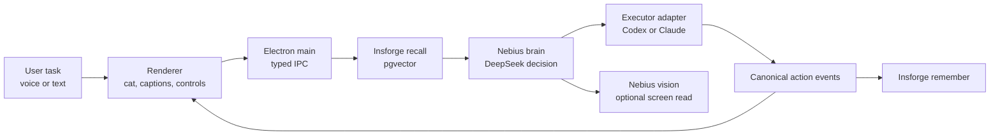

# Nero

**A black pixel-cat coding agent with a face, a voice, and a memory.**

Nero is an Electron app where an animated black pixel cat listens to a task,
thinks through it with Nebius, drives a real coding agent, narrates the work as
it happens, and stores what happened in Insforge memory.

Built for the June 19 Midsummer Multimodal AI Hackathon.

```text
ask -> recall memory -> think on Nebius -> run Codex or Claude -> remember the result
```

Post-demo, the product direction is pet-first: Nero should become the best
desktop AI pet, with coding as one useful trick. See
[`docs/PRODUCT_PLAN.md`](docs/PRODUCT_PLAN.md).

## Why This Exists

Most coding agents still feel like command-line tools with better autocomplete.
Nero makes the agent loop visible and social:

- the cat changes posture when the system is listening, thinking, working, done,
  or stuck
- Nebius reasoning appears as the "thinking" layer
- executor output becomes a normalized action timeline
- Insforge recall is surfaced as a visible memory beat
- the same character layer can run inside the full app or as a transparent
  floating desktop agent

The intended demo is simple: ask the character to fix a bug, watch it plan, watch
it run the coding agent, then ask what it remembers from the earlier turn.

## The Cat

The default character is a procedural 16-bit tuxedo cat drawn with PixiJS in
[`src/renderer/character/avatar.ts`](src/renderer/character/avatar.ts). It does
not need image assets or model files.

The base cat uses a tight four-color palette: black body, white tuxedo and paws,
yellow eyes, and gray inner ears. State effects deliberately expand that palette:
cyan for listening and talking, gold for thinking, blue for work motion, green
and gold for success, and red/orange for errors.

| State | Behavior |
| --- | --- |
| `idle` | breathes, blinks, twitches ears; floating mode slowly cycles stand/sit/walk |
| `listening` | perks up and shows signal pixels |
| `thinking` | sits, looks upward, shows thought pixels |
| `working` | walks with a leg cycle and turns before reversing direction |
| `done` | shows success sparkles |
| `error` | flattens ears and shows alert pixels |
| talking layer | opens the mouth and adds signal pixels while speech is active |

The renderer talks to a model-agnostic `CharacterDriver`
(`setState`, `setMouthOpen`, `setTalking`, `speak`), so a Live2D model can still
be mounted later behind the same interface.

## How It Works



| Subsystem | Role | Source |
| --- | --- | --- |
| Electron shell | windowing, IPC, macOS permission checks, floating mode | [`src/main/`](src/main/) |
| Character | pixel cat, state machine, lip sync facade | [`src/renderer/character/`](src/renderer/character/) |
| Brain | Nebius OpenAI-compatible reasoning, vision, embeddings | [`src/brain/`](src/brain/) |
| Memory | Insforge pgvector remember/recall | [`src/memory/`](src/memory/) |
| Executor | Codex and Claude stream adapters | [`src/executor/`](src/executor/) |
| Voice | Vapi web client and speech events | [`src/renderer/voice/`](src/renderer/voice/) |
| Shared contracts | typed IPC, action events, avatar states | [`src/shared/`](src/shared/) |

The important boundary is the canonical action-event vocabulary in
[`src/shared/events.ts`](src/shared/events.ts). The renderer does not parse raw
Codex or Claude output; it only reacts to normalized events like `command`,
`file_change`, `message`, `run.completed`, and `run.failed`.

## Quick Start

```bash
npm install
npm start
```

For the floating desktop agent:

```bash
COMPANION_FLOATING_WINDOW=1 npm start
```

The floating mode opens a transparent, frameless 380x400 window that hides all
controls and shows only the cat. **Tap or hold the cat to pet it; drag to move it;
right-click to mute.** The cat's body carries only affection + move — talk and
tasking live off the body (see the interaction design spec at
[`docs/superpowers/specs/2026-06-20-nero-interaction-design.md`](docs/superpowers/specs/2026-06-20-nero-interaction-design.md)).
The floating window stays above normal windows and across macOS Spaces,
including full-screen apps. Use the normal app window when you need to give Nero a
task (typed prompt), call controls, captions, and the action timeline.

Nero currently keeps the `COMPANION_*` environment-variable prefix because those
names are part of the existing IPC/config surface.

## Configuration

Create a local `.env` file for live integrations:

```bash
NEBIUS_API_KEY=...
NEBIUS_MODEL=deepseek-ai/DeepSeek-V3.2
NEBIUS_VISION_MODEL=Qwen/Qwen2.5-VL-72B-Instruct
NEBIUS_EMBED_MODEL=Qwen/Qwen3-Embedding-8B

INSFORGE_URL=https://<project>.insforge.app
INSFORGE_KEY=...

COMPANION_WORKDIR=/absolute/path/to/scratch-git-repo
ANTHROPIC_API_KEY=... # optional, only for the Claude executor
```

See [`RUN.md`](RUN.md) for Insforge SQL setup, Vapi proxy notes, macOS
permissions, and the full live-run checklist.

## Development

```bash
npx tsc --noEmit -p tsconfig.json
npx electron-forge package
npm run lint
```

Current note: `npm run lint` may still report existing executor lint issues that
are unrelated to the renderer work. Typecheck and package are the best quick
checks for the current app surface.

## Status

What is working in this branch:

- Electron app builds and packages
- typed IPC between renderer and main
- procedural pixel cat, transparent floating mode, and state effects
- Nebius brain, vision, and embedding client code
- Insforge memory interface and pgvector recall contract
- Codex and Claude executor adapters behind one event stream
- typed text path for driving the orchestrator

What needs live keys or machine permissions:

- real Nebius model calls
- real Insforge round-trips
- Vapi call flow and microphone permission
- screen capture permission for vision
- optional Live2D model swap

## Project Shape

```text
src/main/                 Electron main process and orchestration
src/renderer/             UI, character, voice, captions, event wiring
src/brain/                Nebius decision, vision, and embeddings
src/memory/               Insforge memory read/write
src/executor/             Codex and Claude adapters
src/shared/               IPC, event, memory, and avatar contracts
public/live2d/            optional Live2D assets
RUN.md                    live setup and integration guide
```
