# Nero Presenter-Muted Design Reference

This is a saved design reference only. It is not the live Nero sprite sheet.

Use this for the demo mute state where the presenter/user input is muted, but Nero
itself can still think, work, and finish agent tasks.

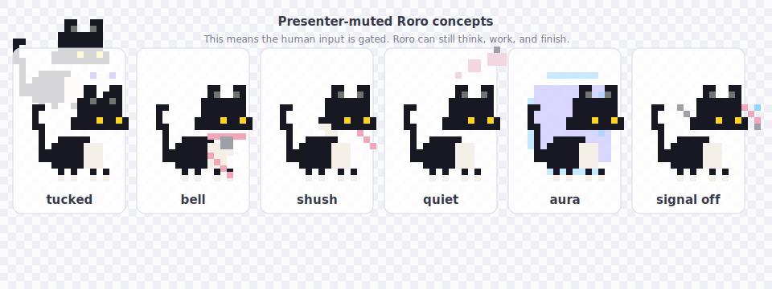

## Floating Badge Experiments

These are saved as comparison concepts, not live UI.

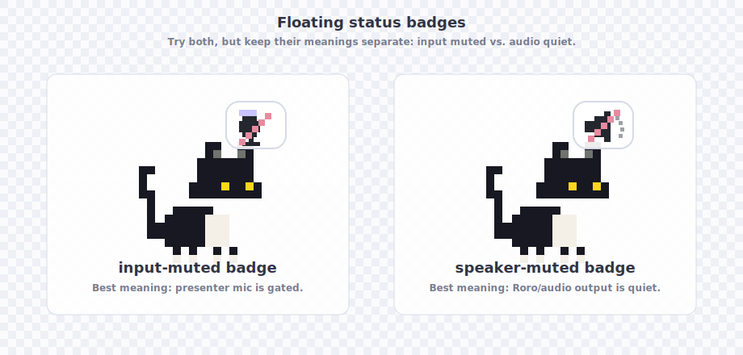

- `input-muted badge`: best for the demo mute state. It means the presenter mic
  is gated while Nero can keep thinking, coding, and finishing.
- `speaker-muted badge`: useful only if we want to show Nero/audio output is
  quiet. It is readable, but it can imply Nero cannot speak.

The strongest implementation path is probably the input-muted badge as the
default, with the speaker-muted badge saved as a separate concept for "quiet
Nero" or output mute later.

## Exact Speaker Reference

These keep pixelated versions of the familiar muted-speaker symbol as direct
visual references. The PNGs are source-derived from the provided reference, so
they preserve the composition more faithfully than the hand-drawn SVG. The
two-color transparent versions are the badge-ready assets.

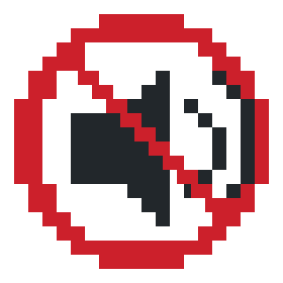

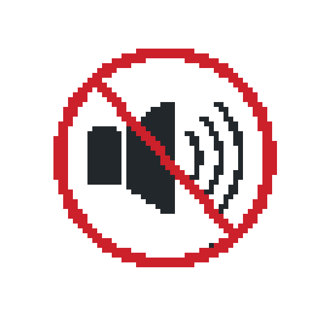

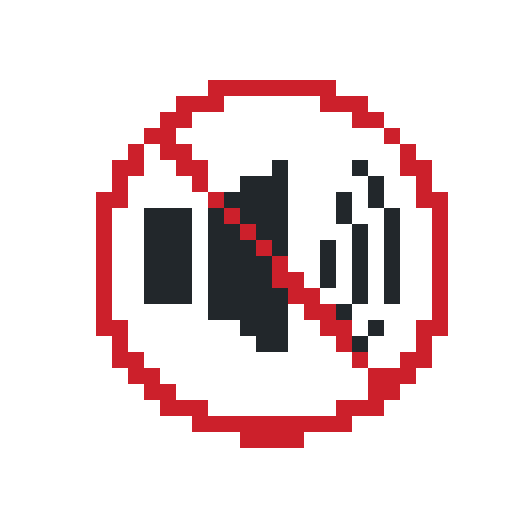

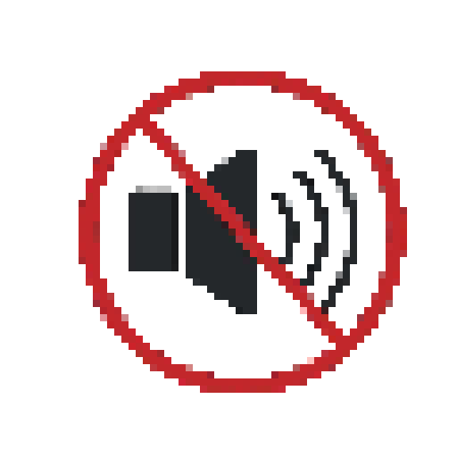

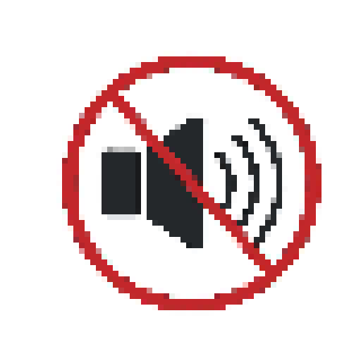

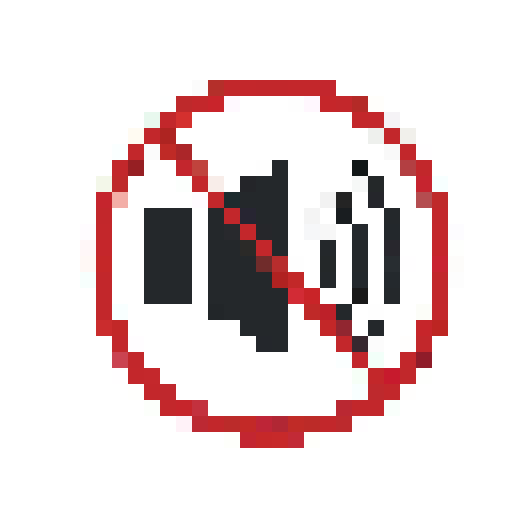

## Exact Mic Reference

These keep pixelated versions of the muted-microphone symbol as direct visual
references. This is the semantically correct icon for presenter/input mute.
The two-color transparent versions are the badge-ready assets.

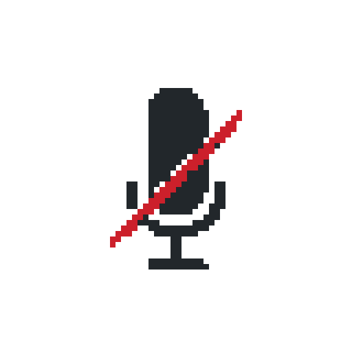

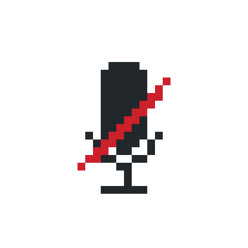

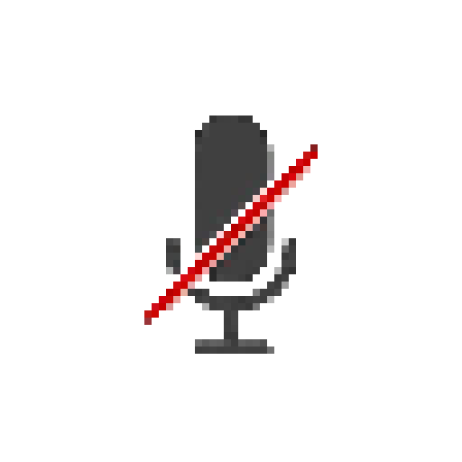

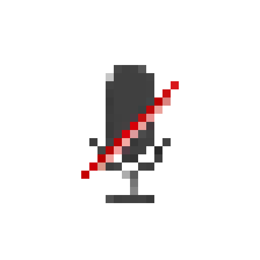

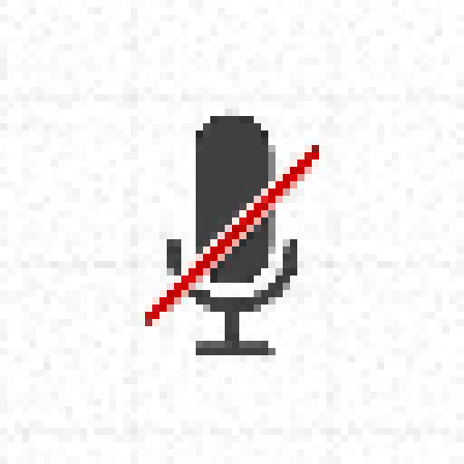

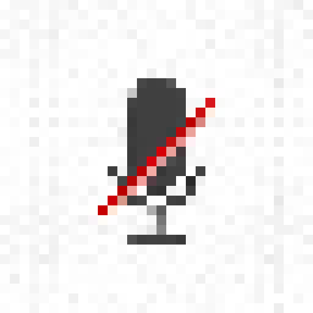

## Naming

Prefer language like:

- presenter muted
- input muted
- hush mode
- judge-talk ignored

Avoid language like:

- agent muted
- Nero stopped
- error
- disabled

## Direction

The strongest direction is to make this state feel calm and intentional:

- ears slightly tucked
- no blue listening signal
- tiny collar bell or soft shush/paw prop
- lavender, soft pink, pale blue, or warm gray accent

Avoid harsh red slash marks. Red reads as failure, but this state is not a
failure. The user is muted; the agent can still be alive and working.

## Options

- `tucked`: best for subtle body language.
- `bell`: clearest symbol if a tiny collar detail survives at small size.
- `shush`: cutest option, but needs careful pixel readability.
- `quiet`: charming, but can imply asleep.
- `aura`: visible at demo distance, but less in-character.
- `signal off`: explicit and practical if we need maximum clarity.

Recommended combination for implementation later:

`ears tucked + signal off + small bell/shush prop + brief "muted" text blip`
